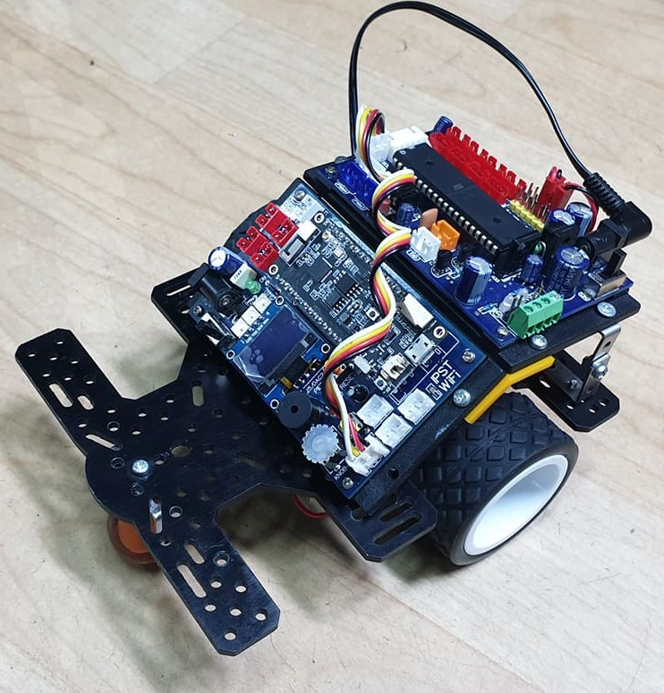

# iRover
  ใช้สำหรับภาษา microPython ipst-WiFi + iKB <br>
    
  ### เริ่มต้น
  ```blocks
  from irover  import * 
  i=IROVER() 
  ```
### การระบุขาใช้งาน

i0 - i7 เรียกใช้พอร์ตบนบอร์ด iKB 

### ตัวอย่าง คำสั่ง OK() 
 ```blocks
 i.OK() #เมื่อเรียกใช้โปรแกรมจะหยุดที่คำสั่งจนกว่าจะกด สวิตช์ SW1 หน้าจอ OLED จะข้อความ "Press SW1 For Start"
  ```
 
### ตัวอย่าง อ่านค่าดิจิตอล 
```blocks
  x= i.input(i5)   #อ่านค่า input จากบอร์ด ikb พอร์ตหมายเลข 5 
  x= i.input(5)   #อ่านค่า input จากบอร์ด ipst-wifi พอร์ตหมายเลข 5 
  x= i.IN(5)   #อ่านค่า input จากบอร์ด ipst-wifi พอร์ตหมายเลข 5
 ```
 ### ตัวอย่าง กำหนดขาดิจิตอล 
 ```blocks
  i.output(i5,1)   #กำหนดลอจิก 1 ที่พอร์ตหมายเลข 5 บนบอร์ด iKB 
  i.output(5,1)   #กำหนดลอจิก 1 ที่พอร์ตหมายเลข 5 บนบอร์ด ipst-wifi 
  i.OUT(5,1)   #กำหนดลอจิก 1 ที่พอร์ตหมายเลข 5 บนบอร์ด ipst-wifi
  ```
### ตัวอย่าง อ่านค่า SW1 บนบอร์ด ipst-wifi
 ```blocks
 x= i.sw1()   #อ่านค่าสถานะสวิตช์ SW1 
  ```
### ตัวอย่าง อ่านค่า Analog 
 ```blocks
  x= i.analog(i5)   #อ่านค่า analog จากบอร์ด iKB พอร์ตหมายเลข 5 การคืนค่า 0-1023 
  x= i.analog(i5,-100,100)   #อ่านค่า analog จากบอร์ด iKB พอร์ตหมายเลข 5 การคืนค่า -100 ถึง 100 
  x= i.analog(34)  #อ่านค่า analog จากบอร์ด ipst-wifi พอร์ตหมายเลข 34 การคืนค่า การคืนค่า 0-1023 
  ```
### ตัวอย่าง อ่านค่า KNOB บนบอร์ด ipst-wifi
 ```blocks
  x=i.knob()  #การคืนค่า 0-4095 
  x=i.knob(-100,100)  #การคืนค่า -100 ถึง 100
 ```
### ตัวอย่าง การใช้งานแสดงข้อความบนจอ OLED
 ```blocks
  i.fill(0)   #ลบการแสดงข้อความบนหน้าจอ OLED 
  i.text("i-Rover",0,1)  #แสดงข้อความ i-Rover ที่ตำแหน่งพิกเซล x=0,y=1 
  i.show() #แสดงข้อความออกทางหน้าจอ
   ```
## ตัวอย่าง คำสั่งมอเตอร์
```blocks
i.motor(1,100)  #คำสั่งควบคุมมอเตอร์ช่อง 1 ให้เดินหน้า 100 %
i.motor(2,-100) #คำสั่งควบคุมมอเตอร์ช่อง 2 ให้ถอยหลัง 100 %                                                   
i.servo(15,90) #คำสั่งควบคุมเซอร์โวมอเตอร์พอร์ต 15 ให้หมุนไปที่มุม 90 องศา	
i.fd(100) #เดินหน้า 100 %	 
i.bk(80) #ถอยหลัง 80 %	  
i.sl(60) #หมุนซ้าย 60 %
i.sr(40) #หมุนขวา 40 %	    
i.tl(60) #เลี้ยวซ้าย 60 %	 
i.tr(60) #เลี้ยวขวา 60 %  
i.fd2(100,50) #เดินหน้าแบบปรับความเร็วแต่ละมอเตอร์ 1 = 100 % มอเตอร์ 2 = 50 %
i.bk2(55,50) #ถอยหลังแบบปรับความเร็วแต่ละมอเตอร์ 1 =  55 % มอเตอร์ 2 = 50 %  
i.stop()	#หยุดเคลื่อนที่
 ```
  
